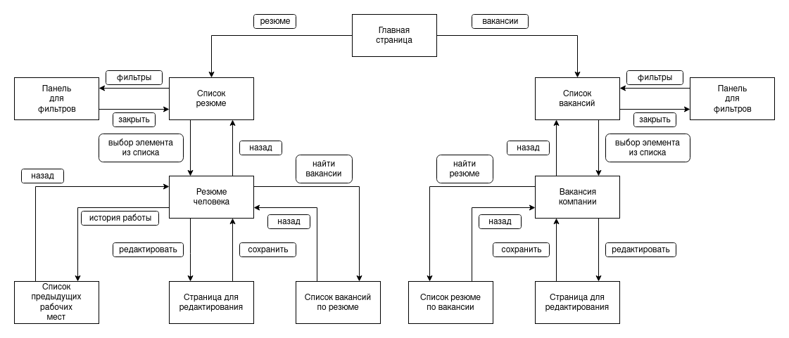
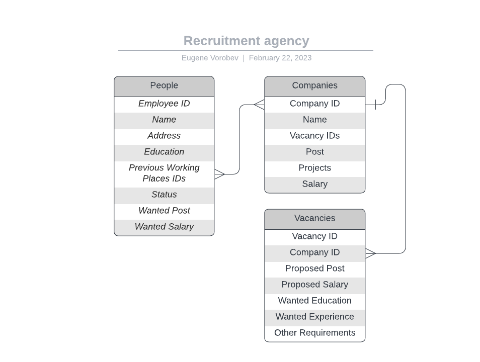

Кадровое агентство
=======================
Описание страниц
-----------------------

-----------------------
С любой страницы можно перейти на главную, нажав соответствующую кнопку.

### Главная страница
- Ссылка на список людей
- Ссылка на список компаний
- Поля для поиска (людей/резюме)

### Страница со списком всех людей
- Список всех людей
- На каждое поле можно нажать, что приведет на страницу с человеком
- Добавление человека

### Страница с человеком
- Возможность редактирования всех данных
- Получение истории работы для данного человека
- Удаление человека

### Страница с местами работы человека
- Список всех мест работы человека
- На каждое поле можно нажать, что приведет на страницу с местом работы
- Добавление места работы

### Страница с местом работы
- Возможность редактирования всех данных
- Удаление места работы

### Страница со списком всех компаний
- Список всех компаний
- На каждую компанию можно нажать, что приведет на страницу с компанией
- Добавление компании

### Страница с компанией
- Возможность редактирования всех данных
- Получение вакансий от данной компании
- Удаление компании

### Страница с вакансиями компании
- Список всех вакансий от компании
- На каждое поле можно нажать, что приведет на страницу с вакансией
- Добавление вакансии

### Страница с вакансией
- Возможность редактирования всех данных
- Удаление вакансии

Схема базы данных
-----------------

Сценарии использования
----------------------

- Создание человека/компании
	- Перейти на главную страницу
	- Перейти на страницу с людьми/компаниями
	- Нажать на кнопку "Добавить человека/компанию"
	- Заполнить необходимые поля, подтвердить изменения в базе данных

- Создание вакансии
    - Перейти на главную страницу
    - Перейти на страницу с компаниями
    - Перейти на страницу компании
    - Перейти на страницу с вакансиями от компании
    - Нажать на кнопку "Добавить вакансию"
    - Заполнить необходимые поля, подтвердить изменения в базе данных

- Добавление места работы для человека
	- Перейти на главную страницу
	- Перейти на страницу с людьми
	- Перейти на страницу человека
	- Перейти на страницу с местами работы человека
	- Нажать на кнопку "Добавить место работы"
	- Заполнить необходимые поля, подтвердить изменения в базе данных

- Поиск людей/вакансий
	- Перейти на главную страницу
	- Выбрать все необходимые параметры поиска
	- Нажать кнопку "Найти людей/вакансии"
	
- Просмотр предыдущих мест работы
	- Перейти на главную страницу
	- Перейти на страницу со списком людей
	- Перейти на страницу человека
	- Нажать на ссылку "Количество предыдущих мест работы"