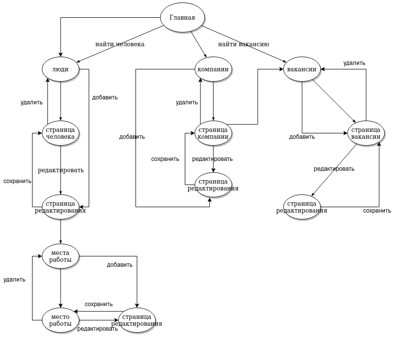
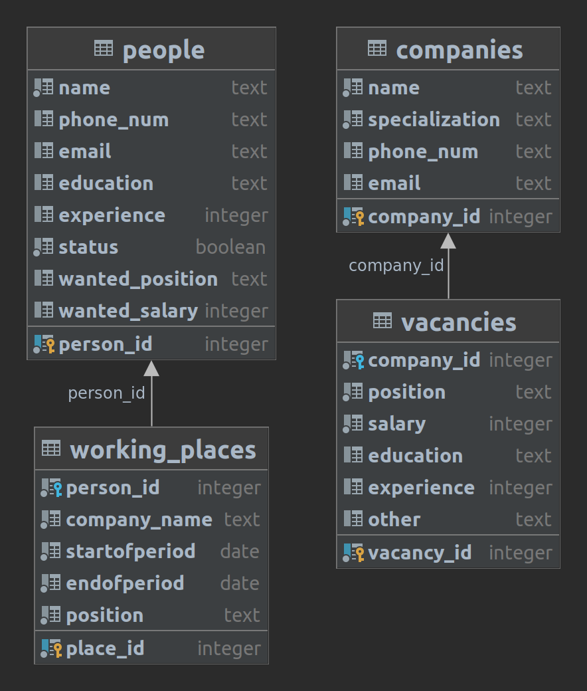

Кадровое агентство
=======================
Описание страниц
-----------------------

-----------------------
С любой страницы можно перейти на главную, нажав соответствующую кнопку.

### Главная страница
- Ссылка на список резюме
- Ссылка на список вакансий
- Ссылка для создания резюме
- Ссылка для создания вакансии

### Страница со списком всех резюме(и окно параметров поиска)
- Список всех резюме, выложенных людьми
- На каждое резюме можно нажать, что приведет на страницу с развернутым резюме
- Получение списка резюме по образованию, компаниям, в которых люди работали, по занимавшимся должностям, зарплатам

### Страница с развернутым резюме
- Возможность редактирования всех данных
- Получение истории работы для данного человека
- Поиск подходящих вакансий на резюме

### Страница со списком всех вакансий(и окно параметров поиска)
- Список всех вакансий, выложенных компаниями
- На каждую вакансию можно нажать, что приведет на страницу с развернутой вакансей
- Получение списка вакансий по компаниям, должностям, зарплатам

### Страница с развернутой вакансей
- Возможность редактирования всех данных
- Поиск подходящих резюме на вакансию

Схема базы данных
-----------------

Сценарии использования
----------------------

- Создание резюме/вакансии
    - Перейти на главную страницу
    - Нажать на кнопку "Добавить резюме/вакансии"
    - Заполнить необходимые поля, подтвердить изменения в базе данных
    
- Поиск резюме/вакансий
	- Перейти на главную страницу
	- Перейти на страницу со списком резюме/вакансий
	- Выбрать все необходимые параметры поиска
	- Нажать кнопку "Поиск"
	
- Просмотр предыдущих мест работы
	- Перейти на главную страницу
	- Перейти на страницу со списком резюме
	- Кликнуть по интересующему резюме
	- Нажать на кнопку "История работы"
	
- Поиск вакансий по резюме(аналогично для поиска резюме по вакансии)
	- Перейти на главную страницу
	- Создать резюме
	- Нажать на кнопку "Найти вакансии"